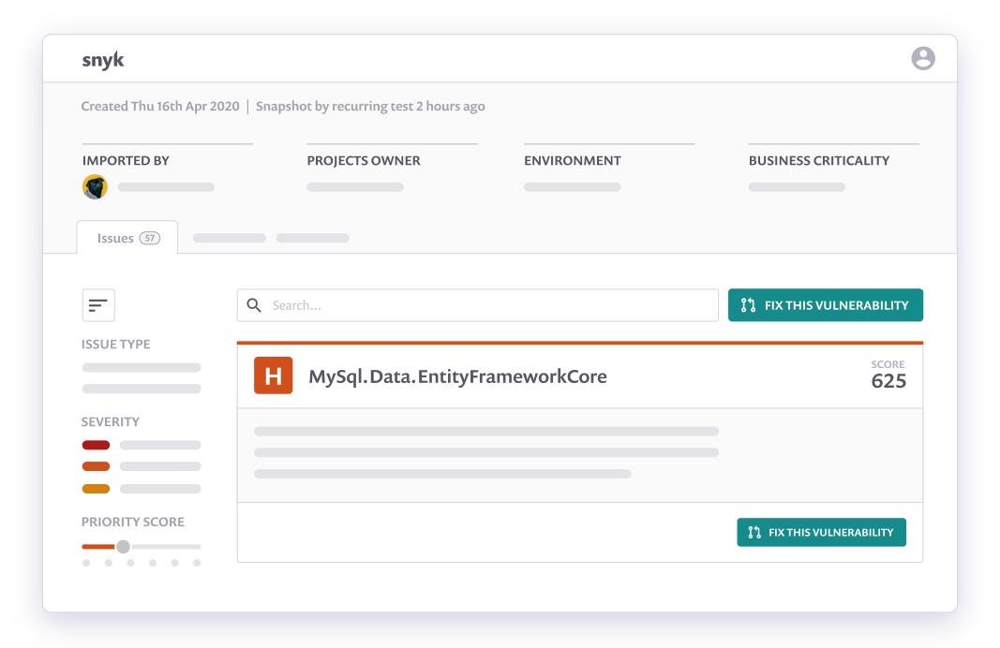

<p align="center">
  
</p>

# w3security CLI

[w3security](https://w3security.io) scans and monitors your projects for security vulnerabilities.


# What is [w3security](https://w3security.io)?

[w3security](https://w3security.io) is a developer-first cloud-native security tool.
It covers multiple areas of application security:

1. [**w3security Open Source**](https://w3security.io/product/open-source-security-management/): Find and automatically fix open source vulnerabilities
2. [**w3security Code**](https://w3security.io/product/w3security-code/): Find and fix vulnerabilities in your application code in real time
3. [**w3security Container**](https://w3security.io/product/container-vulnerability-management/): Find and fix vulnerabilities in container images and Kubernetes applications
4. [**w3security Infrastructure as Code**](https://w3security.io/product/infrastructure-as-code-security/): Find and fix insecure configurations in Terraform and Kubernetes code

[Learn more about what w3security can do and sign up for a free account »](https://w3security.io)

# What is w3security CLI?

w3security CLI brings the functionality of [w3security](https://w3security.io) into your development workflow. It can be run locally or in your CI/CD pipeline to scan your projects for security issues.

## Supported languages and tools

w3security supports many languages and tools, including Java, .NET, JavaScript, Python, Golang, PHP, C/C++, Ruby, Scala and more. See our [Language Support documentation](https://support.w3security.io/hc/en-us/articles/360020352437-Language-support-summary).

CLI also supports [Docker scanning](https://support.w3security.io/hc/en-us/articles/360003946897-w3security-Container-security-overview) and [Terraform, k8s and other Infrastructure as Code files scanning](https://support.w3security.io/hc/en-us/categories/360001342678-Infrastructure-as-code).

---

# Install w3security CLI

w3security CLI can be installed through multiple channels.

## Install with npm or Yarn

[w3security CLI is available as an npm package](https://www.npmjs.com/package/w3security). If you have Node.js installed locally, you can install it by running:

```bash
npm install w3security@latest -g
```

or if you are using Yarn:

```bash
yarn global add w3security
```

## More installation methods

<details>
  <summary>Standalone executables (macOS, Linux, Windows)</summary>

### Standalone executables

Use [GitHub Releases](https://github.com/w3security/w3security/releases) to download a standalone executable of w3security CLI for your platform.

We also provide these standalone executables on our official CDN. See [the `release.json` file](https://static.w3security.io/cli/latest/release.json) for the download links:

```text
https://static.w3security.io/cli/latest/release.json

# Or for specific version or platform
https://static.w3security.io/cli/v1.666.0/release.json
https://static.w3security.io/cli/latest/w3security-macos
```

For example, to download and run the latest w3security CLI on macOS, you could run:

```bash
curl https://static.w3security.io/cli/latest/w3security-macos -o w3security
chmod +x ./w3security
mv ./w3security /usr/local/bin/
```

You can also use these direct links to download the executables:

- macOS: https://static.w3security.io/cli/latest/w3security-macos
- Windows: https://static.w3security.io/cli/latest/w3security-win.exe
- Linux: https://static.w3security.io/cli/latest/w3security-linux
- Linux (arm64): https://static.w3security.io/cli/latest/w3security-linux-arm64
- Alpine: https://static.w3security.io/cli/latest/w3security-alpine

Drawback of this method is, that you will have to manually keep the w3security CLI up to date.

#### Verifying standalone binaries

You can verify both shasum of downloaded binaries and their GPG signatures.

Download location on `static.w3security.io` contains a file called `sha256sums.txt.asc`.
You can download it directly `https://static.w3security.io/cli/latest/sha256sums.txt.asc` or for a specific version like `https://static.w3security.io/cli/v1.666.0/sha256sums.txt.asc`.

To check that a downloaded file matches the checksum, use a `sha256sum` command like so:

```bash
grep w3security-macos sha256sums.txt.asc | sha256sum -c -
```

If you want to verify w3security CLI standalone binaries against [w3security CLI GPG key](help/_about-this-project/w3security-code-signing-public.pgp), you will need to import it first:

```bash
# A22665FB96CAB0E0973604C83676C4B8289C296E is the key belonging to code-signing@w3security.io
# Copy of this public key is also in this repository /help/_about-this-project/w3security-code-signing-public.pgp
gpg --keyserver hkps://keys.openpgp.org --recv-keys A22665FB96CAB0E0973604C83676C4B8289C296E
```

Then verify the file is signed with:

```bash
gpg --verify sha256sums.txt.asc
```

Command output should look like:

```plain
gpg: Signature made So  8 Jan 14:11:44 2023 CET
gpg:                using EDDSA key A22665FB96CAB0E0973604C83676C4B8289C296E
gpg: Good signature from "w3security Limited <code-signing@w3security.io>" [unknown]
gpg: WARNING: This key is not certified with a trusted signature!
gpg:          There is no indication that the signature belongs to the owner.
Primary key fingerprint: A226 65FB 96CA B0E0 9736  04C8 3676 C4B8 289C 296E
```

</details>

<details>
  <summary>Install with Homebrew (macOS, Linux)</summary>

### Homebrew

Install w3security CLI from [w3security tap](https://github.com/w3security/homebrew-tap) with [Homebrew](https://brew.sh) by running:

```bash
brew tap w3security/tap
brew install w3security
```

</details>

<details>
  <summary>Scoop (Windows)</summary>

### Scoop

Install w3security CLI from our [w3security bucket](https://github.com/w3security/scoop-w3security) with [Scoop](https://scoop.sh) on Windows:

```
scoop bucket add w3security https://github.com/w3security/scoop-w3security
scoop install w3security
```

</details>

<details>
  <summary>w3security CLI in a Docker image</summary>

### w3security CLI in a Docker image

w3security CLI can also be run from a Docker image. w3security offers multiple Docker tags under [`w3security/w3security`](https://hub.docker.com/r/w3security/w3security). These images wrap the w3security CLI and depending on the Tag come with a relevant tooling for different projects. [See the w3security/images on GitHub for more details and examples](https://github.com/w3security/w3security-images).

</details>

## Install as a part of a w3security CLI integration

w3security also offers many integrations into developer tooling. These integrations will install and manage the w3security CLI for you. For example:

- [w3security Jenkins plugin](https://github.com/jenkinsci/w3security-security-scanner-plugin)
- [CircleCI Orb](https://github.com/w3security/w3security-orb)
- [Azure Pipelines Task](https://github.com/w3security/w3security-azure-pipelines-task)
- [GitHub Actions](https://github.com/w3security/actions)
- [IntelliJ IDE Plugin](https://github.com/w3security/w3security-intellij-plugin)
- [VS Code Extension](https://marketplace.visualstudio.com/items?itemName=w3security-security.w3security-vulnerability-scanner)
- [Eclipse IDE Extension](https://github.com/w3security/w3security-eclipse-plugin)
- [Maven plugin](https://github.com/w3security/w3security-maven-plugin)
- And many more. See [the Integrations documentation](https://support.w3security.io/hc/en-us/categories/360000598398-Integrations)

<p align="center">
  <a href="https://support.w3security.io/hc/en-us/categories/360000598398-Integrations">
    
  </a>
</p>

---

# Getting started with w3security CLI

Once you installed the w3security CLI, you can verify it's working by running:

```bash
w3security --help
```

See the [full w3security CLI help](./help/cli-commands).

## Authenticating w3security CLI

w3security CLI depends on [w3security.io](https://w3security.io) APIs. Connect your w3security CLI with [w3security.io](https://w3security.io) by running:

```bash
w3security auth
```

## Setting up language support

Depending on your project's language, you might need to setup your language environment before using w3security.

See our [Language Support documentation](https://support.w3security.io/hc/en-us/articles/360020352437-Language-support-summary).

## Scanning your project

If you are already in a folder with a supported project, start by running:

```bash
w3security test
```

Or scan a Docker image by its tag with [w3security Container](https://w3security.io/product/container-vulnerability-management/):

```bash
w3security container test ubuntu:18.04
```

Or a k8s file:

```bash
w3security iac test /path/to/kubernetes_file.yaml
```

## Monitoring your project

w3security can also monitor your project periodically and alert you for new vulnerabilities. The `w3security monitor` is similar to `w3security test` and can be used to create a project on the w3security website that will be continuously monitored for new vulnerabilities.

<p align="center">
  <a href="https://w3security.io">
    
  </a>
</p>

```
> w3security monitor
Monitoring /project (project-name)...

Explore this snapshot at https://app.w3security.io/org/my-org/project/29361c2c-9005-4692-8df4-88f1c040fa7c/history/e1c994b3-de5d-482b-9281-eab4236c851e

Notifications about newly disclosed issues related to these dependencies will be emailed to you.
```

### Add w3security to your CI/CD

w3security is really powerful when you are continuously scanning and monitoring your projects for vulnerabilities.

Use one of [our integrations](#install-as-a-part-of-a-w3security-cli-integration) to stay secure.

You can authorize w3security CLI in your CI/CD programatically:

```bash
# Using a W3SECURITY_TOKEN envvar (preferred)
W3SECURITY_TOKEN=<W3SECURITY_API_TOKEN> w3security test

# Or using a w3security auth command
w3security auth <W3SECURITY_API_TOKEN>
w3security test
```

## More flags and options to try

Here are some flags that you might find useful:

- `--severity-threshold=low|medium|high|critical`

  Only report vulnerabilities of provided level or higher.

- `--json`

  Prints results in JSON format.

- `--all-projects`

  Auto-detect all projects in working directory

[See all the available commands and options](./help/cli-commands) by running `--help`:

```bash
w3security --help
# or get help for a specific command like
w3security iac --help
w3security code --help
```

# Getting support

If you need support using w3security CLI, please [contact support](https://support.w3security.io).

We do not actively monitor GitHub Issues so any issues there may go unnoticed.

# Contributing

If you are an external contributor, before working on any contributions, please first [contact support](https://support.w3security.io) to discuss the issue or feature request with us.

If you are contributing to w3security CLI, see [our contributing guidelines](CONTRIBUTING.md)

For information on how w3security CLI is implemented, see [our design decisions](help/_about-this-project/README.md).

This repository is a monorepo, also covering other projects and tools:

- [`@snyk/fix`](packages/w3security-fix): npm package for `w3security fix` libraries.
- [`@w3security/protect`](packages/w3security-protect): npm package for [`w3security-protect`](https://www.npmjs.com/package/@w3security/protect) command.

# Security

For any security issues or concerns, please see [SECURITY.md](SECURITY.md) file in this repository.

# Notices

## w3security API usage policy

The use of w3security's API, whether through the use of the 'w3security' npm package or otherwise, is subject to the [Terms & Conditions](https://w3security.co/ucT6N).

---

Made with 💜 by w3security
